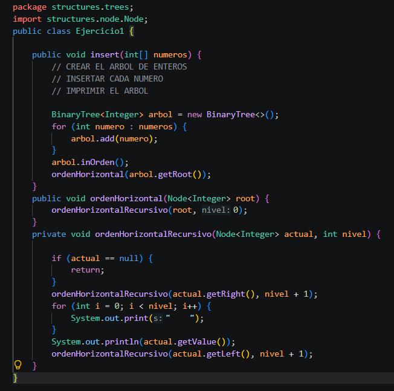
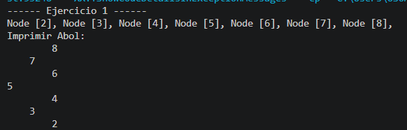
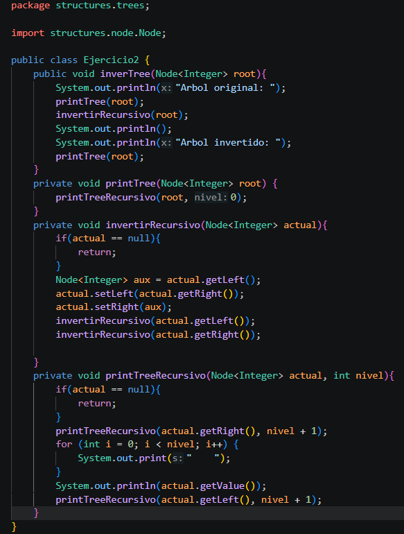
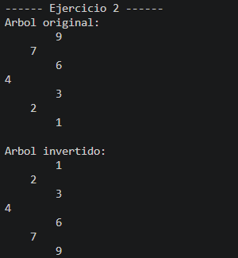
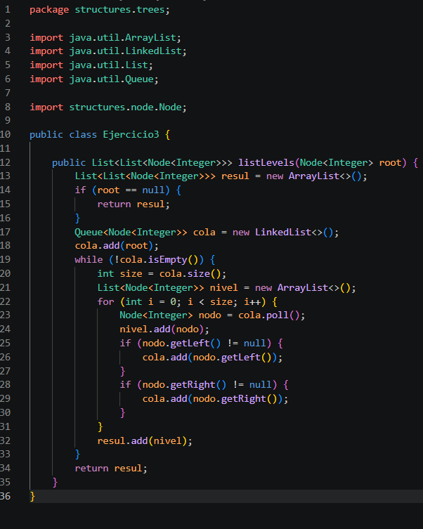
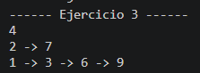
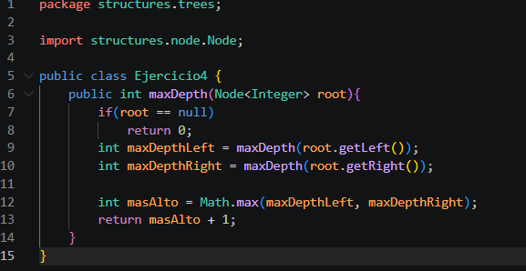
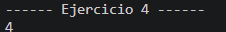
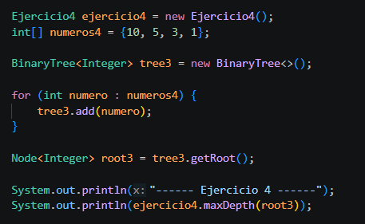

# Practica 04 - Ejercicios de logica con estructuras no linelaes: arboles
## Datos del Estudiante
- **Nombre:** [Santiagosatama]
- **Curso:** [Estructura de Datos Gpo #1]
- **Fecha:** [22/06/2026]

## Descripcion General del Proyecto

 En este proyecto se trabajó con árboles binarios y árboles binarios de búsqueda para resolver distintos ejercicios. Se desarrollaron métodos para insertar nodos invertir la estructura del árbol realizar recorridos por niveles y calcular su profundidad. Gracias a esta práctica se pudo comprender mejor el funcionamiento de los árboles y su utilidad para organizar y procesar información.

---

## Ejercicio 01: Insertar en un Arbol Binario de Busqueda

### Explicacion
En este ejercicio se implemento un metodo insert para crear nuestro arbol e insertar cada numero y para finalizar con su impresion.
Se implemento el metodo printTreeRecursivo el cual recibe como parametros el nodo actual y el nivel, tambien colocamos nuestro caso base que es cuando el nodo es null. Luego imprime el valor del nodo con identacion segun el nivel y se encarga de llamar recursivamente sobre el hijo derecho y el izquierdo.
### Codigo

### Salida de Consola

## Ejercicio 02: Invertir un Arbol Binario 

### Explicacion
Esta clase permite invertir las ramas de un árbol binario. Primero se muestra el árbol original y luego se ejecuta un método recursivo que recorre cada nodo. Durante el recorrido se intercambian los hijos izquierdo y derecho de cada nodo hasta invertir toda la estructura del árbol. Al finalizar se imprime el árbol ya invertido para observar los cambios realizados.

### Codigo

### Salida de Consola

## Ejercicio 03: Listar Niveles en Listas Enlazadas

### Explicacion
**Descripción:** En este ejercicio el árbol fue creado directamente en App.java sin utilizar el método insert. Se implementó el método listLevels, que devuelve una lista con los nodos organizados por niveles. Para ello se utilizó una cola (Queue) que permite recorrer el árbol nivel por nivel. Si la raíz es nula se retorna una lista vacía. Durante el recorrido se extraen los nodos de la cola, se agregan al nivel correspondiente y se incorporan sus hijos izquierdo y derecho cuando existen. Así se obtiene una representación completa del árbol por niveles.

### Codigo

### Salida de Consola

## Ejercicio 04: Calcular la Profundidad Maxima

### Explicacion
**Descripción:** En esta clase se calcula la profundidad máxima de un árbol binario mediante recursividad. El método recibe la raíz del árbol y si el nodo es nulo, retorna cero como caso base. Luego obtiene la profundidad de las ramas izquierda y derecha. Finalmente se compara cuál es mayor con Math.max se suma uno para contar el nodo actual y se devuelve la profundidad máxima del árbol.

### Codigo

### Salida de Consola

### App.java

## Conslusiones
### Conclusión 1:
Esta práctica me permitió comprender mejor cómo funcionan los árboles binarios. Aprendí a realizar inserciones, invertir el árbol, recorrer sus niveles y calcular su profundidad.
### Conclusión 2:
El desarrollo de los ejercicios reforzó el uso de la recursividad y me ayudó a entender la relación entre los nodos para resolver diferentes problemas.

### Conclusión 3:
Implementar y probar cada método me permitió mejorar mi lógica de programación. También aprendí la importancia de verificar que el código funcione correctamente antes de finalizar la práctica.