# Práctica: Estructuras no lineales en Java

## Datos del Estudiante
- **Nombre:** [Santiago Satama]
- **Curso:** [Estructura de Datos Gpo #1]
- **Fecha:** [17/06/2026]

---

## 1. Implementación de Estructuras no lineales

**Fecha:** [19/06/2026]

**Descripción:** En esta práctica se trabajó con árboles binarios y nodos. En `IntTree.java` se implementaron de forma recursiva los recorridos `PreOrder`, `InOrder` y `PostOrder`, además de los métodos `Height` para obtener la altura del árbol y `Weight` para contar sus nodos. Esta actividad permitió reforzar el uso de la recursividad en estructuras jerárquicas.

## Implementacion del codigo 
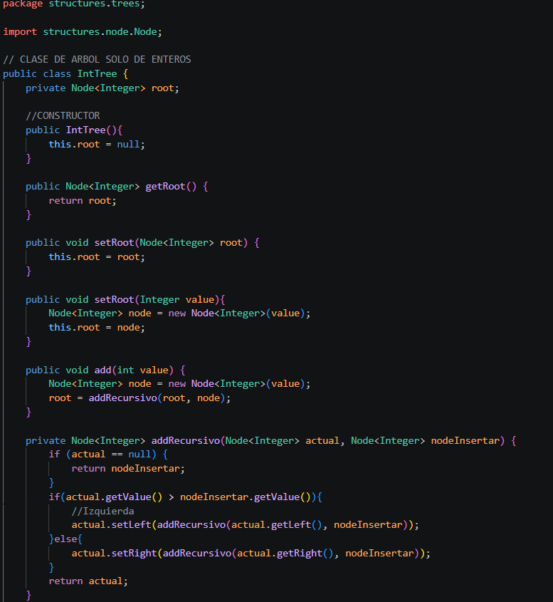
### PreOrden IntTree
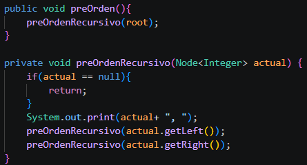
### PosOrden IntTree
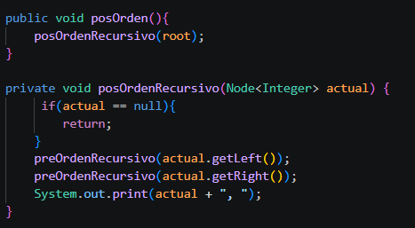
### InOrden IntTree
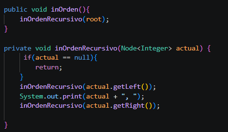
### Height IntTree
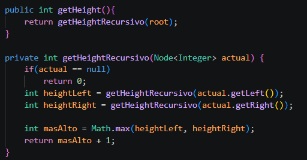
### Weight IntTree
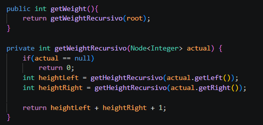
### App.java IntTree
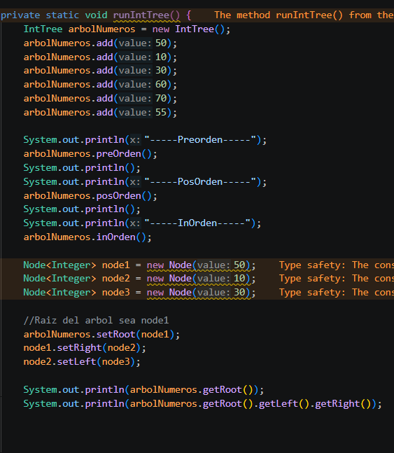

## Salida de consola
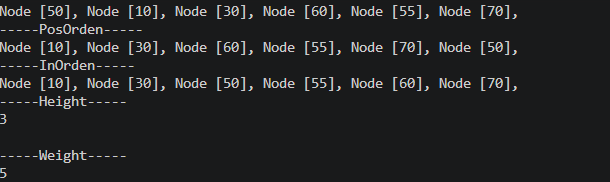

---
**Descripción:** **Descripción:** En esta práctica se utilizó una clase genérica `BinaryTree<T>` para almacenar distintos tipos de datos que implementen `Comparable`. Se creó la clase `Persona` con los atributos nombre y edad, definiendo un criterio de comparación mediante el método `compareTo`. Además, en la clase `BinaryTree` se desarrollaron los recorridos básicos del árbol trabajados en la práctica anterior.

## Implementacion del codigo 
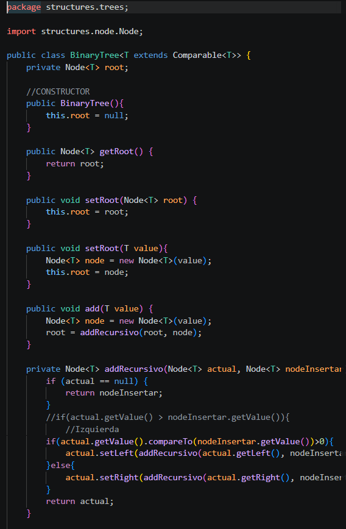
### PreOrden BinaryTree<>
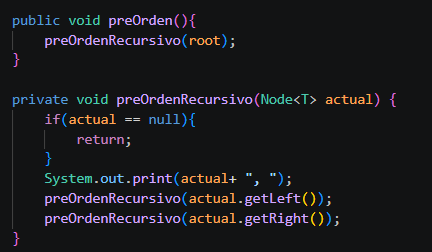
### PosOrden BinaryTree<>
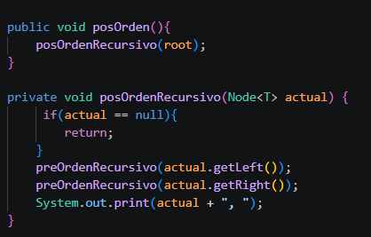
### InOrden BinaryTree<>
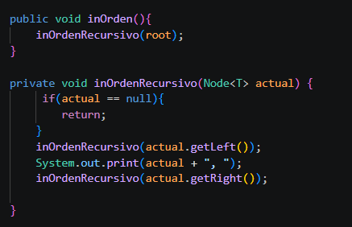
### Height BinaryTree<>
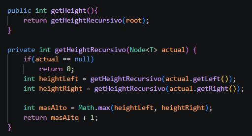
### Weight BinaryTree<>
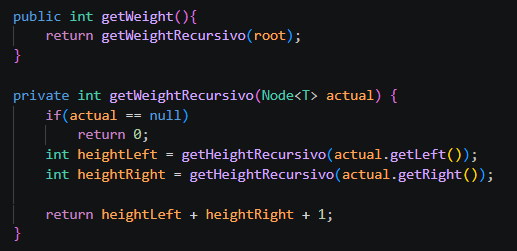
### App.java BinaryTree<>
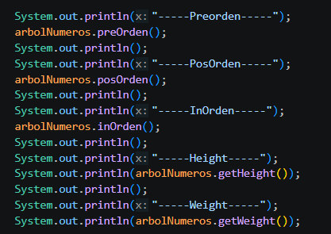

## Salida de consola
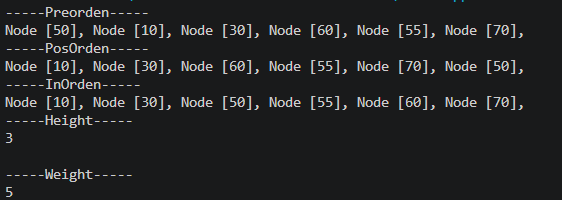